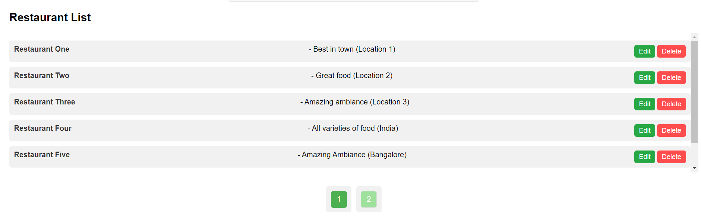

# FOODIEDELIGHT Restaurant Management Application

## Project Overview

This is a simple restaurant management application built with React.js. It allows users to:
- Add, edit, and delete restaurants.
- View the list of restaurants with pagination.
- Validate form inputs when adding/editing restaurants.
- Handle API interactions (mock API) asynchronously without full-page reloads.
- Test coverage for major components and functionalities with Jest and React Testing Library.

## Table of Contents
- [Technologies Used](#technologies-used)
- [Features](#features)
- [How to Run the Project](#how-to-run-the-project)
- [Screenshots](#screenshots)
- [Test Coverage](#test-coverage)
- [Time Breakdown](#time-breakdown)
- [Steps for Future Enhancements](#steps-for-future-enhancements)

## Technologies Used
- **React.js**: Frontend library for building the UI.
- **Jest**: Testing framework for unit and integration testing.
- **React Testing Library**: Utility for testing React components.
- **CSS**: Styling the UI components.
- **Mock API**: Simulating backend API interactions for CRUD operations.


## Features
- **Restaurant Management**: Users can add, edit, and delete restaurants.
- **Form Validation**: Ensures user input is valid before submission.
- **Pagination**: Display up to 10 restaurants per page.
- **Mock API**: Simulates API requests for creating, editing, deleting, and fetching restaurants.
- **Unit and Integration Tests**: Includes tests for critical components and functions.
  
## How to Run the Project

### 1. Clone the Repository
First, clone the repository from GitHub:
```bash
git clone https://github.com/your-repo/foodiedelight.git
cd foodiedelight

##Installs Dependencies:
npm install
## To start the development server locally:
npm start
## To run the test:
npm test 

 ##To check the test coverage:
npm test -- --coverage

Test Coverage Summary:
Statements: 73.18%
Branches: 68.62%
Functions: 76.31%
Lines: 74.68%

Time Breakdown: 

Project Development Breakdown 

1. Initial Setup	             15 minutes
2. UI Development	             2.5 hours
3. Form and Input Validation	 1.5 hours
4. Mock API Setup	    	     1 hour
5. Pagination Implementation	 1.5 hour	
6. Testing (Unit & Integration)	 2.5 hours
7. Error Handling and Edge Cases 1.5 hours
8. Documentation	         	 1 hour
9. Final Code Review             1 hour

**Note: These are not exact times but close to the mentioned time.


## Screenshots

### 1. **Add Restaurant Form**


### 2. **Add Restaurant Form with Validations**


### 3. **Add Restaurant Form with Duplicate Name Validation**


### 4. **Restaurant List with Scroll and Pagination with Edit and Delete**



